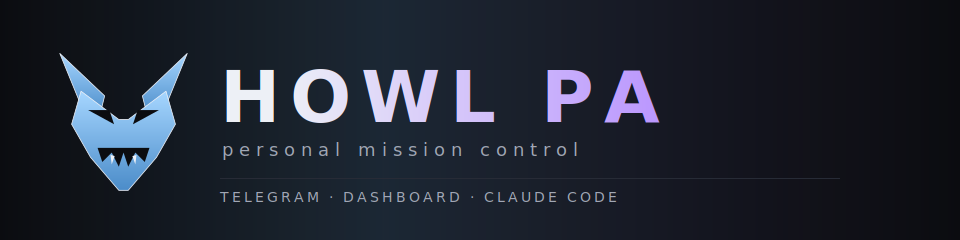

<p align="center">
  
</p>

# Howl PA

Personal Mission Control for one person. One assistant across three surfaces:

- **Phone** — Telegram bot for capture + native Google notifications
- **Laptop** — Dashboard (local or tunneled), Claude Code `/howl` slash command, and Claude Code sessions for real work
- **Anywhere** — Obsidian vault as the second brain

Telegram captures everything, classifies it, writes to the right Obsidian path, and commits. The dashboard is the full control plane: routines, missions, capture, audit transcripts, Claude + Codex usage. The `/howl` Claude Code command hits the same API from inside any editor session. Subagent work routes to Codex by default (non-frontend) and Claude for design, with Ollama as a local council member.

## Install in one command

```sh
curl -fsSL https://raw.githubusercontent.com/sannidhyas/howl-pa/main/install.sh | bash
```

Or the four-step manual path:

```sh
npm i -g howl-pa
howl-pa setup
howl-pa setup:google
howl-pa start
```

## Status

v1.1.0-rc.3: project renamed from ClaudeClaw to howl-pa; legacy `~/.claudeclaw` auto-migrates on first boot.

v1.0.0. Runs daily against a real workload. Ships as an npm package with a bundled Claude Code slash command + MCP plugin.

## Security & credentials

**Howl PA is a single-tenant tool.** Every deployment is one user, their own credentials, their own data. Nothing is shared between users, no credentials are bundled in the package, and no data ever leaves the user's machine unless they explicitly tunnel the dashboard.

### What you own

| Credential | Where you get it | Where it lives |
|---|---|---|
| Telegram bot token | You create your own bot via [@BotFather](https://t.me/botfather) | `<config-dir>/.env` → `TELEGRAM_BOT_TOKEN` |
| Your Telegram chat ID | [@userinfobot](https://t.me/userinfobot) | `<config-dir>/.env` → `ALLOWED_CHAT_ID` |
| Claude Code OAuth token | Run `claude setup-token` on your machine | `<config-dir>/.env` → `CLAUDE_CODE_OAUTH_TOKEN` |
| Google OAuth client (Gmail + Calendar + Tasks) | **You create your own** OAuth 2.0 client (type: Desktop app) in [Google Cloud Console](https://console.cloud.google.com/apis/credentials) | `<config-dir>/.env` → `GOOGLE_CLIENT_ID` + `GOOGLE_CLIENT_SECRET` |
| Google refresh token (exchanged at `setup:google`) | The loopback redirect flow writes this locally | `<config-dir>/google-token.json` (mode 600) |
| Dashboard password (optional) | You choose, during `howl-pa setup` or `howl-pa set-password` | `<config-dir>/.env` → `DASHBOARD_PASSWORD_HASH` (SHA-256 of `salt:password`) |
| Dashboard bearer token | Generated at setup, used by the API + `/howl` Claude Code command | `<config-dir>/.env` → `DASHBOARD_TOKEN` |

`<config-dir>` resolves to `$HOWL_CONFIG`, `$CLAUDECLAW_CONFIG` (deprecated alias), `$XDG_CONFIG_HOME/howl-pa`, `~/.claudeclaw` (legacy — auto-migrated on first boot), or `~/.config/howl-pa`, in that order.

### What is NOT in the repo

- No Telegram tokens
- No Google OAuth client ID or secret
- No Anthropic API keys
- No `.env` with real values (`.env.example` ships only defaults: paths, ports, timeouts)
- No `google-token.json`
- No database, vault contents, or user data

Cloning this repo gives you the code — nothing else. `npm install howl-pa` gives you the compiled binary — still nothing else. You must bring your own credentials to every new machine.

### Google OAuth: who owns what

Howl PA does **not** ship a shared Google OAuth client. Google's Terms of Service forbid redistributing `GOCSPX-*` secrets, and every new user creates their own Desktop-app OAuth client in ~10 seconds:

1. [Google Cloud Console → APIs & Services → Credentials](https://console.cloud.google.com/apis/credentials)
2. Create OAuth 2.0 Client ID → Application type: **Desktop app**
3. Enable the APIs you need: Gmail API, Calendar API, Tasks API
4. Run `howl-pa setup:google` — it prompts for the client ID + secret and then opens the consent page in your browser

The refresh token Howl receives is stored in `<config-dir>/google-token.json` with mode 600. It never leaves your machine.

### Moving to a new machine

```sh
# on the old machine — archive just the credentials (not the data)
howl-pa backup           # writes ~/howl-pa-backup-YYYY-MM-DD.tgz

# copy the tarball securely (scp / rsync / yubikey — your call)

# on the new machine
npm i -g howl-pa
howl-pa backup --restore ~/howl-pa-backup-YYYY-MM-DD.tgz
howl-pa start
```

### Starting over

```sh
howl-pa reset            # auto-backs-up, then wipes .env + google-token.json + db + systemd unit
howl-pa setup            # start fresh
```

## Quickstart

```sh
# 1. Install from npm
npm i -g howl-pa

# fallback for air-gapped / registry-unreachable environments:
# npm i -g https://github.com/sannidhyas/howl-pa/releases/latest/download/howl-pa.tgz

# 2. First-run wizard (PIN, kill phrase, Telegram bot token, chat allowlist,
#    dashboard password)
howl-pa setup

# 3. Google OAuth for Gmail + Calendar + Tasks
howl-pa setup:google

# 4. Start the bot + scheduler + dashboard
howl-pa start

# 5. Or run as a background service (systemd --user)
howl-pa daemon install
```

Then DM your bot on Telegram. See [`docs/install.md`](./docs/install.md) for the full flow, including Claude Code plugin install.

## Docs

- [Setup guide](./docs/setup-guide.md) — step-by-step from zero: every credential, where to get it, what to paste where
- [Install guide](./docs/install.md) — npm, CC plugin, source
- [User guide](./docs/user-guide.md) — every Telegram command, every mission, every dashboard tab
- [Features — current + planned](./docs/features.md) — what ships today, what's on the roadmap
- [Customization](./docs/customization.md) — where to edit to make the bot match your own workflow (daily frontmatter, ritual questions, vault folders, missions)
- [3-device workflow](./docs/3-device-workflow.md) — the mental model the bot is built around
- [Vault conventions](./docs/vault-conventions.md) — what folders the bot owns vs what you own
- [Ritual protocols](./docs/ritual-protocols.md) — the scheduled surveys that run every day

## Highlights

- **Four-layer memory** — FTS5 + vector (Ollama nomic-embed-text) + claude-mem + vault graph, blended in `src/memory.ts`
- **19-role subagent router** — codex-corps taxonomy (backend, debugger, refactor, tests, security, data, infra, research, docs, arch, perf, migrate, integrate, reviewer, prompt, route, oneshot, frontend-logic, frontend-visual, do); per-role telemetry in the dashboard
- **Council mode** — Claude + Codex + Ollama on the same prompt, merged or judged
- **ZotLit-aware thesis mirror** — summarises your Zotero literature back into existing `04_Notes/41_Literature/<citekey>.md` via a `> [!howl-summary]` callout
- **Idea pipeline** — captured ideas land in `08_Pipeline/ideas/<date>-<slug>/`; `/open <slug>` promotes the next free `6N_` project slot
- **Morning ritual → Google Tasks + Calendar** — three needle-movers captured become real tasks and optional time-blocks you get notified about from the native apps
- **PIN + idle auto-lock + kill phrase + exfiltration guard** — the bot reads your inbox, so it earns this
- **Dashboard** on `http://127.0.0.1:3141` with 7 tabs: Overview, Scheduler, Missions, Memories, Subagents, Routing, Audit, Live
- **Multi-bot fanout** — any `TELEGRAM_BOT_TOKEN_<AGENT>` env var spawns a matching specialist bot

## Paid dependencies

None required. Howl PA assumes a Claude subscription and a ChatGPT subscription with `codex login` already done. Everything else (Ollama, SQLite, Baileys-free email/calendar/tasks, Obsidian) is local or free.

## License

MIT — see [LICENSE](./LICENSE).
